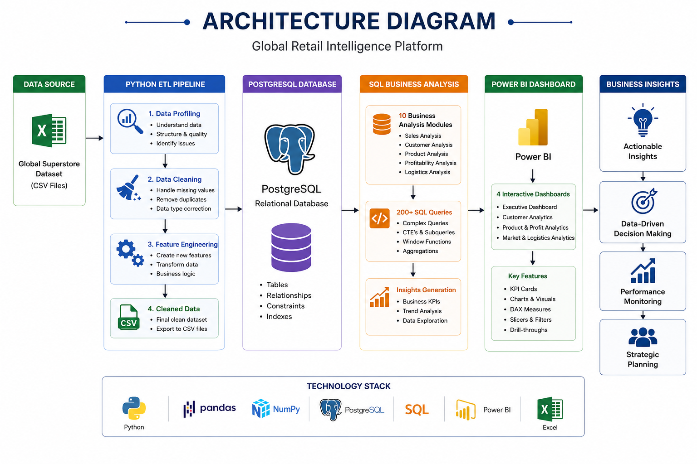
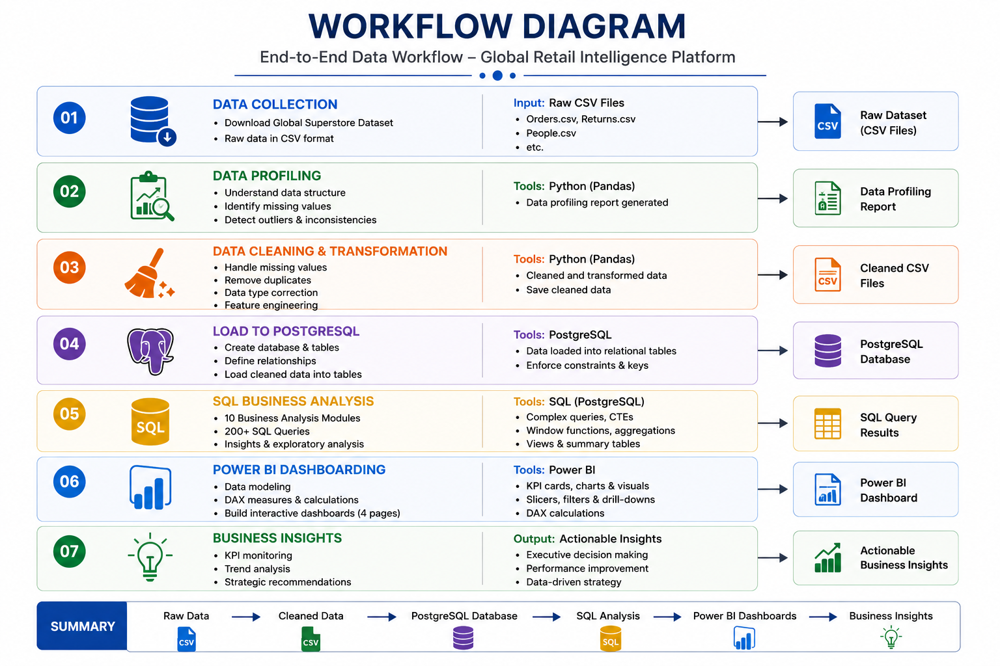

# 🌍 Global Retail Intelligence Platform

<p align="center">


</p>

---

# 📖 Project Overview

The **Global Retail Intelligence Platform** is a complete end-to-end Business Intelligence project that transforms raw retail transaction data into meaningful business insights.

The project demonstrates the complete Data Analytics workflow, including:

- Data Profiling
- Data Cleaning
- Feature Engineering
- PostgreSQL Database Design
- SQL Business Analysis
- Interactive Power BI Dashboard
- Executive Business Insights

This project simulates a real-world retail analytics solution used by business executives to monitor sales performance, customer behavior, product profitability, and logistics efficiency.

---

# 🎯 Business Problem

Retail companies generate massive volumes of transactional data every day. Without proper analysis, organizations struggle to answer critical business questions such as:

- Which products generate the highest profit?
- Which customers contribute the most revenue?
- Which markets perform best?
- How do discounts affect profitability?
- How efficient is the shipping process?

This project solves these challenges using modern Data Analytics tools.

---

# 🏗 Project Architecture

<p align="center">



</p>

---

# 🔄 Project Workflow

<p align="center">



</p>

---

# 🛠 Technology Stack

| Category | Tools |
|-----------|-------|
| Programming | Python |
| Libraries | Pandas, NumPy |
| Database | PostgreSQL |
| Query Language | SQL |
| Visualization | Power BI |
| Version Control | Git |
| IDE | VS Code |
| Spreadsheet | Excel |

---

# 📂 Project Structure

```text
Global-Retail-Intelligence-Platform/
│
├── data/
│   ├── raw/
│   └── cleaned/
│
├── python/
│   ├── data_profiling.py
│   ├── data_cleaning.py
│   └── requirements.txt
│
├── sql/
│   ├── 01_database_setup.sql
│   ├── 02_data_validation.sql
│   ├── 03_sales_analysis.sql
│   ├── 04_customer_analysis.sql
│   ├── 05_product_analysis.sql
│   ├── 06_profit_analysis.sql
│   ├── 07_shipping_analysis.sql
│   ├── 08_market_analysis.sql
│   ├── 09_advanced_sql.sql
│   └── 10_business_insights.sql
│
├── powerbi/
│   └── Global_Retail_Intelligence.pbix
│
├── screenshots/
│
├── docs/
│   ├── architecture.png
│   └── workflow.png
│
├── README.md
└── LICENSE
```

---

# 📊 Dataset Information

| Attribute | Value |
|------------|-------|
| Dataset | Global Superstore |
| Records | 51,290 |
| Columns | 33 |
| Countries | 165 |
| Markets | 5 |
| Categories | 3 |
| Sub Categories | 17 |

---

# ⚙ ETL Pipeline

The Python ETL pipeline performs:

✅ Data Profiling

✅ Missing Value Handling

✅ Duplicate Removal

✅ Data Type Conversion

✅ Feature Engineering

New Features:

- Delivery Days
- Profit Margin
- Order Year
- Order Month
- Month Name
- Quarter
- Weekday
- Loss Flag
- Discount Category

---

# 🗄 PostgreSQL Database

The cleaned dataset is loaded into PostgreSQL.

Database includes:

- Retail Schema
- Orders Table
- Optimized Data Types
- Constraints
- Data Validation

---

# 📈 SQL Analysis

The project contains **10 SQL modules** covering:

- Database Setup
- Data Validation
- Sales Analysis
- Customer Analysis
- Product Analysis
- Profit Analysis
- Shipping Analysis
- Market Analysis
- Advanced SQL Queries
- Business Insights

More than **200 SQL queries** were used to generate business insights.

---

# 📊 Power BI Dashboard

The dashboard consists of **4 interactive pages**.

## 1️⃣ Executive Dashboard

- KPI Cards
- Monthly Sales Trend
- Sales by Market
- Sales by Category
- Profit by Market
- Sales by Segment

---

## 2️⃣ Customer Analytics

- Top Customers
- Customer Segments
- Customer Distribution
- Revenue Analysis
- Customer Profitability

---

## 3️⃣ Product & Profit Analytics

- Top Products
- Product Categories
- Profit Analysis
- Discount Impact
- Product Performance

---

## 4️⃣ Market & Logistics Analytics

- Market Performance
- Country Analysis
- Shipping Cost
- Delivery Analysis
- Order Priority

---

# 📷 Dashboard Screenshots

## Executive Dashboard


---

## Customer Analytics


---

## Product & Profit Analytics


---

## Market & Logistics


---

# 💡 Key Business Insights

- Asia Pacific generated the highest sales.
- Office Supplies contributed the largest revenue share.
- High discounts negatively impacted profitability.
- Consumer Segment generated the highest sales.
- Standard Class was the most frequently used shipping mode.
- Several products generated high revenue but low profit.

---

# 🚀 Installation

Clone the repository

```bash
git clone https://github.com/VijayThotireddy/Global-Retail-Intelligence-Platform.git
```

Go to project folder

```bash
cd Global-Retail-Intelligence-Platform
```

Install Python packages

```bash
pip install -r requirements.txt
```

Run Python ETL

```bash
python python/data_profiling.py

python python/data_cleaning.py
```

Import cleaned data into PostgreSQL.

Open the Power BI file.

---

# 👨‍💻 Author

**Vijayaramireddy Thotireddy**

Data Analyst | Python | SQL | PostgreSQL | Power BI

GitHub:

https://github.com/VijayThotireddy

---

# ⭐ If you found this project useful, consider giving it a Star.
